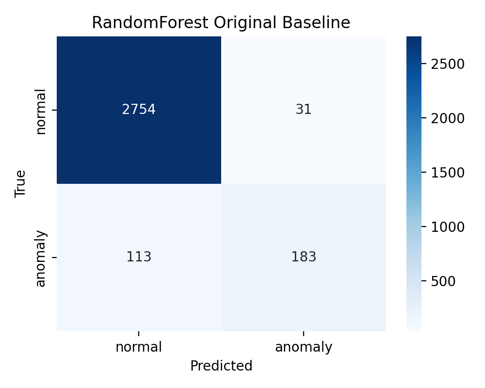
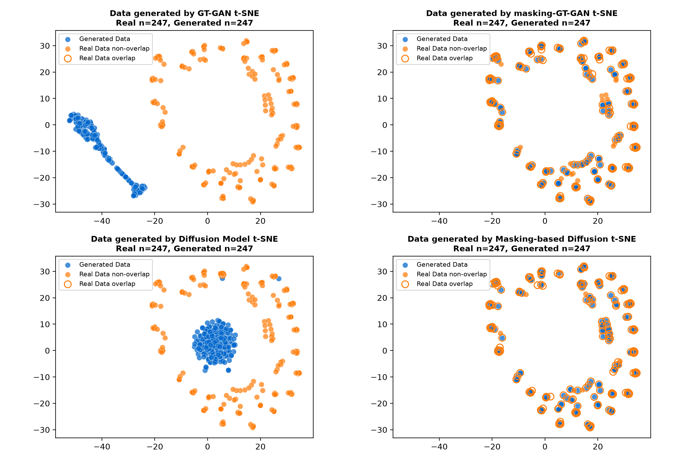
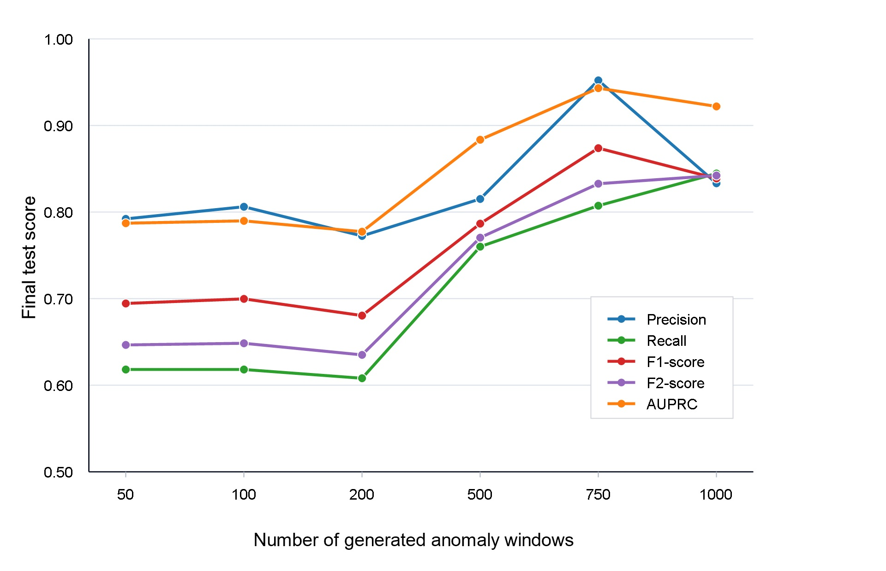
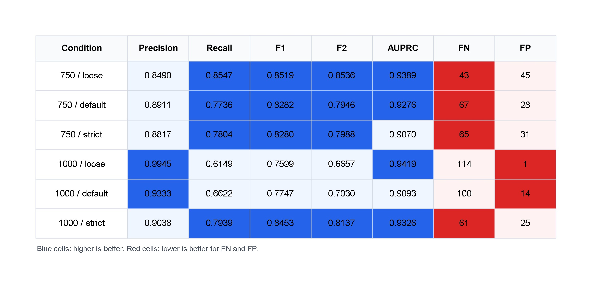
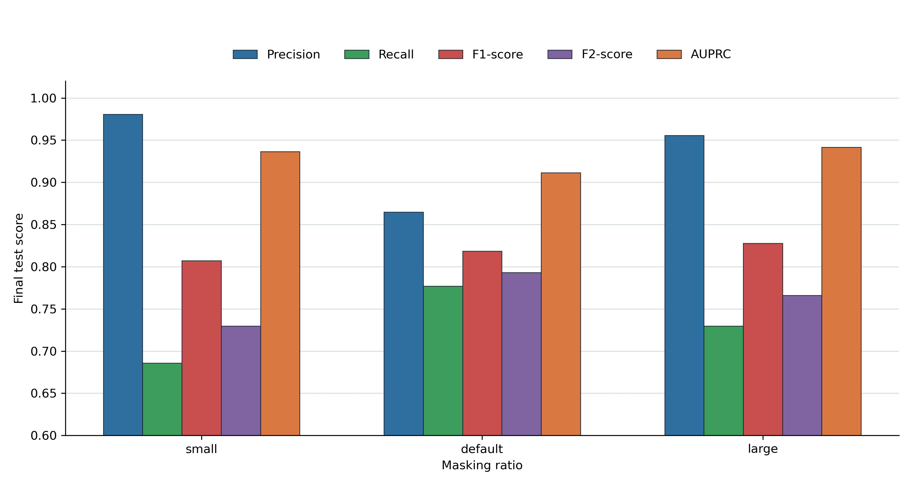

# Manufacturing Time-Series Anomaly Detection Research

제조 용접 공정의 시계열 데이터에서 매우 적은 불량 샘플만으로 이상 탐지 성능을 높일 수 있는지 검증한 연구 저장소입니다. 핵심 문제는 정상 데이터는 충분하지만 실제 불량 seed가 247개뿐인 상황에서, 생성형 증강과 전통적 시계열 증강이 RandomForest 기반 이상 탐지 성능을 얼마나 개선하는가입니다.

현재 연구는 원본 baseline부터 생성 데이터 품질 평가, 지도학습 증강 검증, threshold 최적화, 필터링 전략, 반복 안정성, 증강량 포화, 필터링 강도, 마스킹 비율 분석까지 정리되어 있습니다.

## 연구 질문

- 실제 불량 seed 247개만 사용하는 baseline보다 증강 데이터를 추가했을 때 이상 탐지 성능이 개선되는가?
- GT-GAN, Diffusion, Masking Diffusion 같은 생성형 증강은 전통적 시계열 증강보다 실용적으로 우수한가?
- 생성 샘플은 많이 넣는 것보다 품질 기준으로 필터링하는 것이 더 좋은가?
- threshold를 validation split에서 선택했을 때 final test에서도 안정적으로 작동하는가?
- 불량 seed가 더 부족한 조건에서도 증강 전략의 효과가 유지되는가?
- Filtered Masking Diffusion은 필터링 강도와 마스킹 비율에 얼마나 민감한가?

## 데이터 분할

최종 평가는 학습과 threshold 선택에 사용하지 않은 `final_test` split에서 수행했습니다. Threshold는 `validation` split에서만 선택해 test leakage를 피했습니다.

| Split | Windows | Normal | Anomaly | 역할 |
| --- | ---: | ---: | ---: | --- |
| `normal_train` | 135,730 | 135,730 | 0 | 정상 학습 후보 |
| `anomaly_train_seed` | 247 | 0 | 247 | 실제 불량 seed |
| `validation` | 1,447 | 1,283 | 164 | Threshold 선택 |
| `final_test` | 3,081 | 2,785 | 296 | 최종 평가 |

대부분의 비교 실험은 정상 window 5,000개와 실제 불량 seed 247개를 공통 조건으로 사용했습니다.

## 핵심 결과 요약

| 조건 | Precision | Recall | F1 | AUPRC | 해석 |
| --- | ---: | ---: | ---: | ---: | --- |
| Original only | 0.855 | 0.618 | 0.718 | 0.800 | 원본 seed만으로는 recall이 낮음 |
| Masking Diffusion 1,000 | 0.962 | 0.764 | 0.851 | 0.938 | 생성형 증강으로 baseline 개선 |
| Filtered Masking Diffusion 750 | 0.952 | 0.807 | 0.874 | 0.943 | 품질 필터링 후 F1 개선 |
| Magnitude warping 500 | 0.927 | 0.811 | 0.865 | 0.940 | 전통 증강 중 강한 기준선 |
| Loose Filtered Masking Diffusion 750 | 0.849 | 0.855 | 0.852 | 0.939 | recall 중심 설정에서 우수 |

전체적으로 증강은 원본 baseline의 낮은 recall 문제를 개선했습니다. 다만 단순히 생성형 방법이 항상 전통적 증강보다 우수하다고 결론내리기는 어렵습니다. Magnitude warping과 Noise injection 같은 전통적 증강도 매우 강한 성능을 보였고, 생성형 방법은 필터링과 threshold 전략을 함께 설계했을 때 더 실용적이었습니다.

## 연구 흐름

### Research01: 원본 데이터 baseline

실제 불량 seed 247개와 정상 window 5,000개만 사용해 RandomForest baseline을 구성했습니다.

| Method | Precision | Recall | F1 | AUROC | AUPRC |
| --- | ---: | ---: | ---: | ---: | ---: |
| Real anomaly only | 0.855 | 0.618 | 0.718 | 0.959 | 0.800 |

원본 데이터만으로도 precision은 높지만 recall이 낮아, 실제 불량을 놓치는 문제가 확인되었습니다.



### Research02: 생성 데이터 품질 비교

GT-GAN, Diffusion, Masking GT-GAN, Masking Diffusion을 비교했습니다. 일반 GT-GAN/Diffusion은 noise에서 전체 window를 생성하고, masking 계열은 실제 불량 seed의 관측값을 보존하면서 선택된 시간 구간과 feature group만 복원하도록 구성했습니다.

Masking 전략은 element-wise random masking이 아니라 정상-불량 분포 차이가 큰 시간 영역과 feature group을 우선하는 data-driven adaptive masking입니다. 이 과정에서 RealPower가 가장 큰 feature 차이를 보였고, Masking Diffusion은 GRU 기반 temporal denoiser를 사용했습니다.

품질 평가는 t-SNE, 실제 불량 centroid와의 거리, 정상 centroid와의 분리, IsolationForest downstream 성능으로 확인했습니다. 생성 품질 순위는 대체로 Masking GT-GAN, Masking Diffusion, Diffusion, GT-GAN 순이었습니다.



### Research03-04: 지도학습 증강과 threshold 최적화

생성된 불량 window를 RandomForest 학습 데이터에 추가하고 validation split에서 threshold를 선택한 뒤 final test에서 평가했습니다. Masking Diffusion 1,000개 조건은 baseline보다 F1, recall, AUPRC를 모두 개선했습니다.

| Method | Generated anomalies | Precision | Recall | F1 | AUROC | AUPRC |
| --- | ---: | ---: | ---: | ---: | ---: | ---: |
| Real anomaly only | 0 | 0.855 | 0.618 | 0.718 | 0.959 | 0.800 |
| Masking Diffusion | 1,000 | 0.962 | 0.764 | 0.851 | 0.990 | 0.938 |

Threshold 최적화에서는 precision-recall trade-off가 크게 달라졌습니다. 예를 들어 Masking Diffusion 1,000개에서 best validation F1 threshold는 F1 0.915를 보였고, recall 중심 전략에서는 final recall 0.956까지 올랐습니다.

### Research05-06: 전통 증강, class balance, 생성 샘플 필터링

Balanced 조건과 imbalanced 조건을 나누어 비교했습니다. 단순히 정상 데이터를 불량 수에 맞춰 줄이는 1:1 class balance는 유리하지 않았습니다. 정상 데이터 정보를 과하게 버리면 final test 성능이 낮아졌습니다.

| Condition | Best method | Precision | Recall | F1 | AUROC | AUPRC |
| --- | --- | ---: | ---: | ---: | ---: | ---: |
| Balanced | Frequency domain | 0.698 | 0.686 | 0.692 | 0.954 | 0.729 |
| Imbalanced | Magnitude warping | 0.964 | 0.814 | 0.883 | 0.994 | 0.959 |

생성형 증강은 생성 샘플을 전부 쓰기보다 품질 기준으로 선별했을 때 실용성이 좋아졌습니다. `Filtered@750 Masking Diffusion`은 생성형 후보 중 가장 안정적인 결과를 보였습니다.

| Method | Generated anomalies | Precision | Recall | F1 | AUROC | AUPRC |
| --- | ---: | ---: | ---: | ---: | ---: | ---: |
| Masking Diffusion | 1,000 | 1.000 | 0.716 | 0.835 | 0.993 | 0.956 |
| Filtered@750 Masking Diffusion | 750 | 0.953 | 0.818 | 0.880 | 0.991 | 0.944 |
| Magnitude warping | 1,000 | 0.964 | 0.814 | 0.883 | 0.994 | 0.959 |

### Research07: threshold 강건성, 반복 안정성, scarce seed

Precision floor 0.90 조건에서 threshold sweep을 수행하고, 주요 후보를 30회 반복 실행해 평균과 분산을 확인했습니다.

| Method | Precision mean | Recall mean | F1 mean | AUPRC mean |
| --- | ---: | ---: | ---: | ---: |
| Original only | 0.838 | 0.564 | 0.668 | 0.784 |
| Masking Diffusion | 0.929 | 0.740 | 0.821 | 0.924 |
| Filtered@750 Masking Diffusion | 0.899 | 0.716 | 0.792 | 0.911 |
| Magnitude warping | 0.931 | 0.802 | 0.860 | 0.950 |

반복 안정성까지 고려하면 Magnitude warping이 가장 안정적인 후보였고, 생성형 후보는 baseline보다 뚜렷하게 좋아졌지만 seed가 극단적으로 적은 조건에서는 한계가 있었습니다.

### Research08: 증강량 포화 분석

50, 100, 200, 500, 750, 1,000개 증강량을 비교해 각 방법이 어느 지점에서 성능이 포화되는지 분석했습니다. 95% plateau 기준으로 Masking Diffusion은 대체로 500개, Filtered Masking Diffusion은 750개 부근에서 주요 지표가 포화되었습니다.

| Augmentation count | Best method by F2 | Precision | Recall | F1 | F2 | AUPRC |
| ---: | --- | ---: | ---: | ---: | ---: | ---: |
| 50 | Frequency domain | 0.734 | 0.716 | 0.725 | 0.720 | 0.799 |
| 100 | Masking Diffusion | 0.885 | 0.676 | 0.766 | 0.709 | 0.850 |
| 200 | Noise injection | 0.833 | 0.743 | 0.786 | 0.760 | 0.871 |
| 500 | Magnitude warping | 0.927 | 0.811 | 0.865 | 0.832 | 0.940 |
| 750 | Filtered Masking Diffusion | 0.952 | 0.807 | 0.874 | 0.833 | 0.943 |
| 1,000 | Filtered Masking Diffusion | 0.833 | 0.845 | 0.839 | 0.842 | 0.922 |



### Research09: 필터링 강도 분석

Filtered Masking Diffusion의 필터링 강도를 `loose`, `default`, `strict`로 나누어 비교했습니다. 750개 증강 조건에서는 loose filter가 F1, F2, recall 기준으로 가장 좋았습니다.

| Filtering strength | Count | Precision | Recall | F1 | F2 | AUPRC | FN | FP |
| --- | ---: | ---: | ---: | ---: | ---: | ---: | ---: | ---: |
| default | 750 | 0.891 | 0.774 | 0.828 | 0.795 | 0.928 | 67 | 28 |
| loose | 750 | 0.849 | 0.855 | 0.852 | 0.854 | 0.939 | 43 | 45 |
| strict | 750 | 0.882 | 0.780 | 0.828 | 0.799 | 0.907 | 65 | 31 |
| strict | 1,000 | 0.904 | 0.794 | 0.845 | 0.814 | 0.933 | 61 | 25 |

Loose 조건은 anomaly radius를 넓히고 normal radius 기준을 완화해 더 다양한 후보를 남겼습니다. 그 결과 false positive는 늘었지만 false negative가 크게 줄어 recall 중심 목적에 유리했습니다.



### Research10: 마스킹 비율 분석

Loose filtering과 750개 target count를 고정하고, Masking Diffusion의 temporal block ratio와 feature group ratio를 비교했습니다.

| Masking ratio | Temporal block | Feature group | Precision | Recall | F1 | F2 | AUPRC | FN | FP |
| --- | ---: | ---: | ---: | ---: | ---: | ---: | ---: | ---: | ---: |
| small | 0.15 | 0.20 | 0.981 | 0.686 | 0.807 | 0.730 | 0.937 | 93 | 4 |
| default | 0.25 | 0.40 | 0.865 | 0.777 | 0.819 | 0.793 | 0.911 | 66 | 36 |
| large | 0.35 | 0.60 | 0.956 | 0.730 | 0.828 | 0.766 | 0.941 | 80 | 10 |

마스킹 비율은 precision과 recall의 균형을 바꿨습니다. Small mask는 매우 높은 precision과 낮은 FP를 보였고, default mask는 recall/F2가 가장 좋았으며, large mask는 F1과 AUPRC 관점에서 좋은 절충안을 보였습니다.



## 현재 결론

이 연구의 현재 결론은 “생성형 증강이 항상 전통적 증강보다 우수하다”가 아니라, 불량 seed가 적고 정상 데이터가 많은 제조 이상 탐지 문제에서는 다음 조건들이 성능을 좌우한다는 것입니다.

- 정상 데이터를 과하게 버리지 않고 imbalanced 구조를 유지해야 합니다.
- Threshold는 validation split에서 선택하고 final test는 분리해야 합니다.
- 생성형 증강은 수량보다 품질 필터링과 사용 목적이 중요합니다.
- Recall 중심이면 loose filtering이 효과적이고, precision 중심이면 더 작은 마스킹 또는 엄격한 threshold가 유리합니다.
- 전통 증강, 특히 Magnitude warping과 Noise injection은 여전히 강한 baseline입니다.
- 생성형 후보 중에서는 Filtered Masking Diffusion이 가장 실용적인 방향입니다.

## 프로젝트 구조

```text
data/
  raw_data/              원본 train/test 데이터
  preprocessed/          라벨 정리 및 전처리 데이터
  augmentation_split/    normal/anomaly seed/validation/final test 분할
  research01/            원본 데이터 RandomForest baseline
  research02/            GT-GAN, Diffusion, Masking 생성 데이터 품질 비교
  research03/            생성형 증강 지도학습 성능 검증
  research05/            balanced/imbalanced 및 전통 증강 비교
  research07/            threshold 강건성, 반복 안정성, scarce seed 분석
  research08/            증강량 포화 분석
  research09/            필터링 강도 분석
  research10/            마스킹 비율 분석
notebooks/
  Research01_baseline_pipeline.ipynb
  Research02_Generate_Data.ipynb
  Research03_Validate_Data.ipynb
  Research04_MaskingDiffusion_RF_Threshold_Optimization.ipynb
  Research05_Balanced_vs_Imbalanced_Augmentation.ipynb
  Research06_filtering.ipynb
  Research07.ipynb
  Research08.ipynb
  Research09.ipynb
tools/
  research01_randomforest_baseline.py
  research02_generate_data.py
  research03_model_augmented_validation.py
  research05_balanced_aug_experiment.py
  research08_augmentation_saturation.py
  research09_filtering_strength.py
  research10_masking_ratio.py
pictures/
  README와 논문/발표용 주요 그림
```

## 재현 방법

필요 패키지 예시는 다음과 같습니다.

```powershell
pip install numpy pandas matplotlib seaborn scikit-learn torch
```

저장소 루트에서 주요 실험 스크립트를 순서대로 실행할 수 있습니다.

```powershell
python tools/research01_randomforest_baseline.py
python tools/research02_generate_data.py
python tools/research03_model_augmented_validation.py
python tools/research05_balanced_aug_experiment.py
python tools/research08_augmentation_saturation.py
python tools/research09_filtering_strength.py
python tools/research10_masking_ratio.py
```

각 실험의 CSV, JSON 결과는 `data/researchXX/results/` 아래에 저장되며, 주요 그림은 `pictures/`에 정리되어 있습니다.

## 주요 결과 파일

- `data/research01/results/research01_randomforest_baseline_summary.json`
- `data/research02/results/research02_summary.json`
- `data/research03/results/research03_model_improvement_summary.json`
- `data/research05/results/research05_summary.json`
- `data/research07/results/research07_stability_summary.csv`
- `data/research08/results/research08_summary.json`
- `data/research09/results/research09_filtering_strength_summary.json`
- `data/research10/results/research10_masking_ratio_summary.json`

## 주의 사항

- 모든 주요 성능 수치는 `final_test` split 기준입니다.
- Threshold는 `validation` split에서만 선택했습니다.
- 일부 생성 데이터 경로는 로컬 절대경로가 포함된 JSON을 그대로 보존하고 있으므로, 다른 환경에서 재실행할 때는 저장소 상대경로 기준으로 다시 생성하는 것이 좋습니다.
- 최종 방법 선택은 단일 최고 점수만이 아니라 precision-recall trade-off, 반복 안정성, seed 부족 조건, false negative 비용을 함께 고려해야 합니다.
